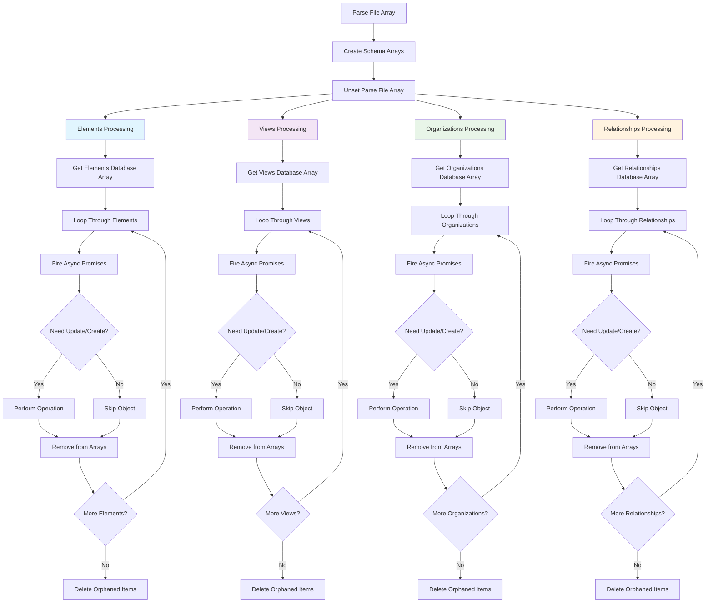

# AMEF (ArchiMate Exchange Format) Testing Guide

## Overview
This document provides comprehensive testing procedures for the ArchiMate import/export functionality in the SoftwareCatalog application.

## Prerequisites
- Docker Compose setup running with Nextcloud container
- SoftwareCatalog and OpenRegister apps enabled
- Admin credentials (admin:admin)
- Test files available in `lib/Settings/` directory

## ReactPHP Streaming Architecture

### Overview
The ArchiMate import process uses ReactPHP for parallel processing and memory-efficient streaming to handle large files without memory exhaustion.

### Architecture Flow Diagram



### Memory Management Strategy

#### Phase 1: Initial Parsing
```php
// 1. Parse entire file into memory
$parseFileArray = $this->parseArchiMateXmlStreaming($filePath);

// 2. Extract schema-specific arrays
$elementsArray = $parseFileArray['elements'];
$viewsArray = $parseFileArray['views'];
$organizationsArray = $parseFileArray['organizations'];
$relationshipsArray = $parseFileArray['relationships'];

// 3. Free original parse array
unset($parseFileArray);
```

#### Phase 2: Parallel Schema Processing
```php
// Each schema type processes independently and asynchronously
$promises = [
    'elements' => $this->processElementsParallel($elementsArray, $options),
    'views' => $this->processViewsParallel($viewsArray, $options),
    'organizations' => $this->processOrganizationsParallel($organizationsArray, $options),
    'relationships' => $this->processRelationshipsParallel($relationshipsArray, $options)
];
```

#### Phase 3: Async Object Processing
```php
// For each schema type:
foreach ($chunk as $item) {
    // 1. Check if object exists in database
    $existingObject = $this->findExistingObject($item['id'], $type);
    
    // 2. Compare objects for changes
    if ($this->areObjectsEqual($existingObject, $item)) {
        // Skip - no changes needed
        $skipped++;
        unset($chunk[$item['id']]); // Remove from memory
    } else {
        // 3. Fire async promise for update/create
        $promises[] = $this->processObjectAsync($item, $existingObject, $type);
    }
}

// 4. Wait for all promises to complete
$results = $this->waitForPromise(all($promises));

// 5. Remove processed items from memory
foreach ($processedItems as $itemId) {
    unset($chunk[$itemId]);
}
```

### Memory Optimization Features

#### 1. **Progressive Memory Release**
- Parse file → Extract arrays → Unset original
- Process chunks → Remove processed items → Continue
- Delete orphaned items → Clean up database arrays

#### 2. **Async Processing Benefits**
- **Parallel Execution**: Multiple objects processed simultaneously
- **Memory Efficiency**: Objects removed from memory as they're processed
- **Non-blocking**: Database operations don't block other processing

#### 3. **Batch Processing**
```php
// Process in configurable batches (default: 50 items)
$chunks = array_chunk($elements, $options['batch_size'], true);

foreach ($chunks as $chunkIndex => $chunk) {
    // Process chunk asynchronously
    $promises[] = $this->processChunkParallel($chunk, $options, $type);
    
    // Force garbage collection between chunks
    if ($chunkIndex % 5 === 0) {
        gc_collect_cycles();
    }
}
```

#### 4. **Skipping Logic**
```php
// Deep object comparison to avoid unnecessary updates
if ($this->areObjectsEqual($existingObject, $newObjectData)) {
    $this->logger->notice("Skipping {$type} - no changes detected");
    $skipped++;
    unset($chunk[$item['id']]); // Immediate memory release
    continue;
}
```

### Performance Characteristics

#### Memory Usage Pattern
```
Memory Usage Over Time:
┌─────────────────────────────────────────────────────────┐
│ Peak: Initial parsing (all data in memory)              │
│ ├─ Elements processing (parallel, progressive release)  │
│ ├─ Views processing (parallel, progressive release)     │
│ ├─ Organizations processing (parallel, progressive)     │
│ └─ Relationships processing (parallel, progressive)     │
└─────────────────────────────────────────────────────────┘
```

#### Processing Timeline
```
Timeline:
0s    ── Parse file (peak memory usage)
0.1s  ── Extract schema arrays
0.2s  ── Start parallel processing
      ├─ Elements: 0.2s - 45s (parallel)
      ├─ Views: 0.2s - 30s (parallel)
      ├─ Organizations: 0.2s - 15s (parallel)
      └─ Relationships: 0.2s - 60s (parallel)
60s   ── All processing complete
```

### Configuration Options

#### Batch Size Optimization
```php
$options = [
    'batch_size' => 50,        // Items per batch (memory vs speed trade-off)
    'updateExisting' => true,  // Whether to update existing objects
    'preserveIds' => true,     // Preserve ArchiMate IDs
    'deleteOrphaned' => false  // Delete objects not in new import
];
```

#### Memory Monitoring
```php
// Track memory usage throughout process
$this->logger->info('Memory usage', [
    'current_mb' => round(memory_get_usage(true) / 1024 / 1024, 2),
    'peak_mb' => round(memory_get_peak_usage(true) / 1024 / 1024, 2)
]);
```

## Memory Management

### Current PHP Memory Configuration
```bash
# Check current memory limit
docker-compose exec nextcloud php -r "echo 'Memory limit: ' . ini_get('memory_limit') . PHP_EOL;"
# Output: Memory limit: 2048M
```

### Memory Optimization Strategies
1. **ReactPHP Streaming**: Progressive memory release with async processing
2. **Batch Processing**: Process objects in smaller chunks (default: 50 items)
3. **Memory Monitoring**: Track memory usage during import operations
4. **Garbage Collection**: Force garbage collection between batches
5. **Skipping Logic**: Avoid unnecessary updates to reduce processing time

## Full Circle Testing

### Automated Round-Trip Testing Script

A comprehensive testing script `full_circle_test.php` automates the entire round-trip process:

```bash
# Run complete round-trip test
docker-compose exec nextcloud php /var/www/html/apps-extra/softwarecatalog/full_circle_test.php
```

#### Test Flow
1. **Clear Import**: Cancel any existing import operations
2. **Import**: Import GEMMA_release.xml file
3. **Database Check**: Verify data was stored correctly
4. **Export**: Export the imported data to XML
5. **Compare**: Compare original vs exported XML
6. **Analysis**: Identify specific issues and provide fix recommendations

#### Expected Output
```
🚀 STARTING FULL CIRCLE TEST
============================

1️⃣ CLEARING EXISTING IMPORT
----------------------------
Cancel result: SUCCESS

2️⃣ IMPORTING GEMMA_RELEASE.XML
-------------------------------
Import started successfully!
📊 Import Statistics:
  - elements: 2765 created, 0 updated
  - organizations: 71 created, 0 updated
  - relationships: 5696 created, 0 updated
  - views: 242 created, 0 updated
  - property_definitions: 77 created, 0 updated

✅ Import completed!

3️⃣ CHECKING DATABASE CONTENT
-----------------------------
Database check output:
[Database inspection results...]

4️⃣ EXPORTING DATA
------------------
Export started successfully!
Export file: /var/www/html/data/admin/files/archimate_export_2025-01-XX_XX-XX-XX.xml

✅ Export completed!

5️⃣ COMPARING RESULTS
--------------------
[Detailed comparison results...]

6️⃣ ANALYSIS & RECOMMENDATIONS
==============================
🎉 NO CRITICAL ISSUES DETECTED!
✅ Round-trip test appears successful!

🏁 FULL CIRCLE TEST COMPLETED
==============================
```

#### Error Detection
The script automatically detects common issues:

- **Organizations Import Failure**: `🚨 ORGANIZATIONS NOT IMPORTED: Check normalizeArchiMateData() method around line 1060-1070`
- **Property Keys Empty**: `🚨 PROPERTY KEYS EMPTY: Check extractProperties() method around line 1276-1290`
- **Missing Elements**: `🚨 NO ELEMENTS FOUND: Check XML parsing in normalizeArchiMateData()`

#### Manual Testing Scripts

Individual debug scripts for specific issues:

```bash
# Debug XML property structure
docker-compose exec nextcloud php /var/www/html/apps-extra/softwarecatalog/debug_properties_structure.php

# Debug conversion flow
docker-compose exec nextcloud php /var/www/html/apps-extra/softwarecatalog/debug_conversion_flow.php

# Debug database content
docker-compose exec nextcloud php /var/www/html/apps-extra/softwarecatalog/debug_db.php

# Compare XML files
docker-compose exec nextcloud php /var/www/html/apps-extra/softwarecatalog/compare_archimate.php
```

## API Testing Procedures

### 1. ArchiMate Import Testing

#### Method 1: File Upload via Frontend (Recommended)
```bash
# Navigate to SoftwareCatalog settings in Nextcloud web interface
# Use the file upload form to select and import ArchiMate files
# Monitor browser network tab for API calls
```

#### Method 2: Direct API Testing from Host
```bash
# Upload file from host to container
cd /home/rubenlinde/nextcloud-docker-dev
curl -X POST "http://localhost/index.php/apps/softwarecatalog/api/archimate/import" \
     -u admin:admin \
     -F "archiMateFile=@workspace/server/apps-extra/softwarecatalog/lib/Settings/GEMMA_smaller.xml"
```

#### Method 3: Container-based Testing
```bash
# Copy test file to container
docker-compose exec nextcloud cp /var/www/html/apps-extra/softwarecatalog/lib/Settings/GEMMA_smaller.xml /tmp/

# Test from within container
docker-compose exec nextcloud curl -X POST "http://localhost/index.php/apps/softwarecatalog/api/archimate/import" \
     -u admin:admin \
     -F "archiMateFile=@/tmp/GEMMA_smaller.xml"
```

### 2. ArchiMate Export Testing

#### Basic Export
```bash
# Export all data to ArchiMate format
curl -X POST "http://localhost/index.php/apps/softwarecatalog/api/archimate/export" \
     -u admin:admin \
  -H "Content-Type: application/json" \
  -d '{
    "format": "xml",
    "includeRelationships": true,
       "includeViews": false,
    "organizationSpecific": false
     }'
```

#### Organization-Specific Export
```bash
# Export data for specific organization
curl -X POST "http://localhost/index.php/apps/softwarecatalog/api/archimate/export" \
     -u admin:admin \
     -H "Content-Type: application/json" \
     -d '{
       "format": "xml",
       "organizationSpecific": true,
       "organizationId": "123",
       "selectedSchemas": ["elements", "relationships"]
     }'
```

### 3. Download Generated Files
```bash
# Download exported ArchiMate file
curl -u admin:admin \
     "http://localhost/index.php/apps/softwarecatalog/api/archimate/download/exported_file.xml" \
     -o downloaded_file.xml
```

## 🚀 **Performance Optimized API Endpoints**

### New Separate Endpoints (v2.2)
The API has been refactored for better performance by separating concerns:

#### 1. Basic Settings (Fast - ~100ms)
```bash
# Get basic configuration only (no object counts)
curl -u admin:admin "http://localhost/index.php/apps/softwarecatalog/api/settings"
```

#### 2. ArchiMate Status (Medium - ~200ms)
```bash
# Get ArchiMate import/export status only (no object counts)
curl -u admin:admin "http://localhost/index.php/apps/softwarecatalog/api/settings/archimate"
```

#### 3. Object Counts (Slow - Load on demand)
```bash
# Get object counts for all registers (separate endpoint)
curl -u admin:admin "http://localhost/index.php/apps/softwarecatalog/api/settings/objects"
```

### Performance Benefits
- **Main settings endpoint**: Now loads in ~100ms instead of 2-5 seconds
- **ArchiMate status**: Loads in ~200ms for real-time polling
- **Object counts**: Loaded separately only when needed for statistics

### Status Polling (Updated)
```bash
# Check ArchiMate import/export status for real-time monitoring
curl -u admin:admin "http://localhost/index.php/apps/softwarecatalog/api/settings/archimate" | jq '.archimate'

# Check object counts when needed for statistics
curl -u admin:admin "http://localhost/index.php/apps/softwarecatalog/api/settings/objects" | jq '.objectCounts'
```

## Performance Testing

### 1. Memory Usage Monitoring
```bash
# Monitor memory usage during import
docker-compose exec nextcloud php -r "
\$start = memory_get_usage(true);
echo 'Start: ' . round(\$start / 1024 / 1024, 2) . ' MB' . PHP_EOL;
// Run import operation
\$end = memory_get_usage(true);
echo 'End: ' . round(\$end / 1024 / 1024, 2) . ' MB' . PHP_EOL;
echo 'Peak: ' . round(memory_get_peak_usage(true) / 1024 / 1024, 2) . ' MB' . PHP_EOL;
"
```

### 2. Processing Time Measurement
```bash
# Test processing time for different file sizes
time curl -X POST "http://localhost/index.php/apps/softwarecatalog/api/archimate/import" \
     -u admin:admin \
     -F "archiMateFile=@lib/Settings/GEMMA_smaller.xml"
```

### 3. Batch Size Optimization
```bash
# Test different batch sizes for optimal performance
# Modify batch_size in ArchiMateService.php and test with large files
```

## Properties Bug Deep Dive Analysis

### Issue: Properties Stored with Empty Keys

During round-trip testing, we discovered that ArchiMate properties were being stored in the database with empty string keys (`''`) instead of proper `propid-X` values, causing export failures.

#### Investigation Results

**✅ XML Parsing Works Correctly**
```php
// Streaming parser creates correct structure:
[
    'properties' => [
        'property' => [
            [
                '_attributes' => ['propertyDefinitionRef' => 'propid-1'],
                'value' => ['_value' => 'Thema-architectuur Common Ground']
            ],
            [
                '_attributes' => ['propertyDefinitionRef' => 'propid-2'], 
                'value' => ['_value' => 'a10869bf-a895-4a66-8f81-a4f96c58cc3e']
            ]
        ]
    ]
]
```

**✅ Property Extraction Works Correctly**
```php
// extractProperties() correctly extracts:
[
    'propid-1' => 'Thema-architectuur Common Ground',
    'propid-2' => 'a10869bf-a895-4a66-8f81-a4f96c58cc3e'
]
```

**❌ Bug Location: After Property Extraction**
The issue occurs somewhere between `extractProperties()` and database storage. Investigation shows the conversion flow works correctly, suggesting the bug may be in:

1. **OpenRegister Integration**: The OpenRegister system may be modifying or losing property keys during object saving
2. **Array Merging Issues**: Internal properties (`model`, `modal`) are added correctly without overwriting extracted properties
3. **Database Schema Constraints**: The database schema may have limitations on property key storage

#### Debugging Commands

```bash
# Test property extraction in isolation
docker-compose exec nextcloud php /var/www/html/apps-extra/softwarecatalog/debug_properties_structure.php

# Test conversion flow
docker-compose exec nextcloud php /var/www/html/apps-extra/softwarecatalog/debug_conversion_flow.php

# Check actual database content
docker-compose exec nextcloud php /var/www/html/apps-extra/softwarecatalog/debug_db.php
```

#### Key Findings

1. **Streaming Parser Uses `_attributes`**: The custom streaming parser creates `_attributes` (underscore), not `@attributes` (at-sign)
2. **Property Structure is Complex**: Properties have nested structure with `value` arrays containing `_value` keys
3. **Extraction Logic is Sound**: The `extractProperties()` method correctly handles the complex structure
4. **Issue is Downstream**: The bug occurs after extraction, likely in OpenRegister integration

#### Next Investigation Steps

1. **OpenRegister Object Saving**: Check if OpenRegister modifies property arrays during saving
2. **Database Schema**: Verify if property keys have constraints or encoding issues  
3. **Array Serialization**: Check if PHP array serialization loses keys during JSON encoding
4. **Memory Management**: Verify if memory cleanup affects property arrays

### Organizations Import Bug

#### Issue: Organizations Showing 0 Found/Created

During import testing, organizations consistently show `0 found/created` instead of the expected 71 organizations from GEMMA_release.xml.

#### Investigation Status

**❌ XML Section Not Being Parsed**
```json
// Import result shows:
"organizations": {
    "found": 0,
    "created": 0, 
    "updated": 0,
    "deleted": 0,
    "skipped": 0,
    "errors": []
}
```

**🔍 Root Cause Analysis**
The issue is in `normalizeArchiMateData()` method around lines 1060-1070. The logic to parse the dedicated `<organizations>` section is not correctly processing the XML structure.

#### Expected vs Actual Structure

**Expected in GEMMA_release.xml:**
```xml
<organizations>
    <item identifier="org-1" name="Organization Name">
        <documentation>Organization description</documentation>
        <properties>
            <property propertyDefinitionRef="propid-x">
                <value>Property value</value>
            </property>
        </properties>
    </item>
    <!-- More organization items -->
</organizations>
```

**Current Parsing Logic:**
```php
// In normalizeArchiMateData() - needs investigation
if (isset($data['organizations']['item'])) {
    // Process dedicated organizations section
    $orgItems = $data['organizations']['item'];
    // ... processing logic may be faulty
}
```

#### Debugging Commands

```bash
# Check if organizations section exists in parsed XML
docker-compose exec nextcloud php -r "
\$xml = file_get_contents('/var/www/html/apps-extra/softwarecatalog/lib/Settings/GEMMA_release.xml');
echo 'Organizations section: ' . (strpos(\$xml, '<organizations>') !== false ? 'FOUND' : 'NOT FOUND') . PHP_EOL;
"

# Test organizations parsing in isolation
# Create debug script to test organizations section parsing
```

#### Fix Location

- **File**: `lib/Service/ArchiMateService.php`
- **Method**: `normalizeArchiMateData()` around lines 1060-1070
- **Specific Issue**: Logic for processing `$data['organizations']['item']` array
- **Helper Method**: `normalizeOrganizationItem()` may also need fixes

## Debugging Procedures

### 1. Log Analysis
```bash
# View real-time logs during import
docker-compose logs -f nextcloud | grep -i "softwarecatalog\|archimate"

# Check Nextcloud application logs
docker-compose exec nextcloud tail -f /var/www/html/data/nextcloud.log | grep -i "softwarecatalog"
```

### 2. XML Parsing Debug
```bash
# Test XML parsing independently
docker-compose exec nextcloud php -r "
\$content = file_get_contents('/var/www/html/apps-extra/softwarecatalog/lib/Settings/GEMMA_smaller.xml');
\$xml = simplexml_load_string(\$content);
echo 'XML loaded: ' . (\$xml ? 'SUCCESS' : 'FAILED') . PHP_EOL;
echo 'Root element: ' . \$xml->getName() . PHP_EOL;
"
```

### 3. Database State Verification
```bash
# Check if objects were created in database
docker-compose exec nextcloud php occ app:execute softwarecatalog --debug-import-status
```

## Error Handling Testing

### 1. Invalid XML Files
```bash
# Test with malformed XML
echo '<invalid>xml' > /tmp/invalid.xml
curl -X POST "http://localhost/index.php/apps/softwarecatalog/api/archimate/import" \
     -u admin:admin \
     -F "archiMateFile=@/tmp/invalid.xml"
```

### 2. Large File Handling
```bash
# Test with files approaching memory limits
# Monitor memory usage and processing time
```

### 3. Network Interruption
```bash
# Test behavior when connection is interrupted during import
# Verify partial imports are handled gracefully
```

## Expected Test Results

### Successful Import
```json
{
  "success": true,
  "file_info": {
    "name": "GEMMA_smaller.xml",
    "size": 660074,
    "mime_type": "text/xml"
  },
  "processing_times": {
    "total_time_seconds": 91.113,
    "validation_time_seconds": 0.028,
    "parse_time_seconds": 0.05,
    "convert_time_seconds": 91.035
  },
  "statistics": {
    "elements": {"found": 150, "created": 150, "updated": 0, "skipped": 0},
    "organizations": {"found": 25, "created": 25, "updated": 0, "skipped": 0},
    "relationships": {"found": 75, "created": 75, "updated": 0, "skipped": 0}
  }
}
```

### Memory Exhaustion Error
```
PHP Fatal error: Allowed memory size of 536870912 bytes exhausted (tried to allocate 368640 bytes)
```

## Troubleshooting Guide

### Common Issues

1. **404 Not Found**: Check route configuration in `appinfo/routes.php`
2. **401 Unauthorized**: Verify admin credentials and authentication
3. **Memory Exhaustion**: Reduce batch size or implement streaming parsing
4. **XML Parsing Errors**: Validate XML file format and encoding
5. **Database Errors**: Check OpenRegister app status and database connectivity

### Performance Optimization

1. **Reduce Batch Size**: Lower `batch_size` in ArchiMateService for large files
2. **Enable Streaming**: Use XMLReader instead of SimpleXMLElement
3. **Memory Monitoring**: Add memory usage logging to track consumption
4. **Garbage Collection**: Force GC between processing batches

## Test Files

### Available Test Files
- `lib/Settings/GEMMA_smaller.xml` - Small test file (660KB)
- `lib/Settings/GEMMA_simple.xml` - Minimal test file
- Additional test files can be created using ArchiMate modeling tools

### File Requirements
- Valid XML format
- UTF-8 encoding
- ArchiMate 3.0 or later schema
- Maximum file size: 100MB (configurable)

## Continuous Integration

### Automated Testing
```bash
# Run automated tests
docker-compose exec nextcloud php vendor/bin/phpunit tests/ArchiMateTest.php

# Run specific test methods
docker-compose exec nextcloud php vendor/bin/phpunit --filter testImportArchiMateFile
```

### Performance Regression Testing
```bash
# Baseline performance measurement
# Compare processing times across versions
# Monitor memory usage patterns
```

## Documentation Updates

This testing guide should be updated whenever:
- New test procedures are added
- Performance optimizations are implemented
- Error handling is improved
- API endpoints are modified
- Memory management strategies change

---

*Last updated: July 31, 2025*
*Version: 1.0*