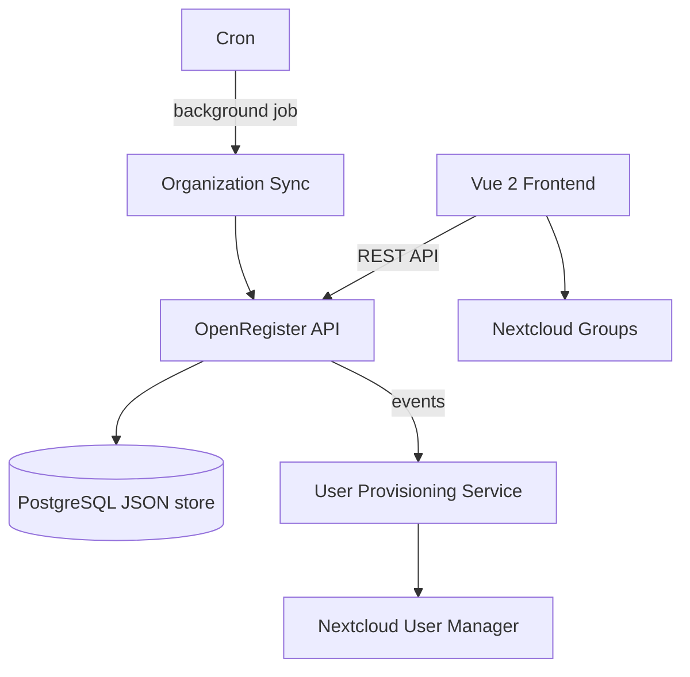

> [!IMPORTANT]
> ## 🚚 This repository has moved to Codeberg
>
> Active development now happens at **https://codeberg.org/Conduction/softwarecatalog**.
> This GitHub mirror is read-only — issues, pull requests, and new commits should go to Codeberg.
> Update your remote with: `git remote set-url origin https://codeberg.org/Conduction/softwarecatalog`<p align="center">
  
</p>

<h1 align="center">Software Catalogus</h1>

<p align="center">
  <strong>GEMMA-compliant software catalog for Nextcloud — applications, modules, and integration management</strong>
</p>

<p align="center">
  <a href="https://github.com/ConductionNL/softwarecatalog/releases"></a>
  <a href="https://github.com/ConductionNL/softwarecatalog/blob/main/LICENSE"></a>
  <a href="https://github.com/ConductionNL/softwarecatalog/actions"></a>
  <a href="https://softwarecatalog.app"></a>
</p>

---

Software Catalogus brings structured software portfolio management to Nextcloud. Register the applications, modules, and connections (koppelingen) that make up your organization's IT landscape, manage contacts and organizations, and synchronize catalog data across a federated open data network — all aligned with Dutch GEMMA standards.

It integrates with [OpenRegister](https://github.com/ConductionNL/openregister) for data storage and automatic user provisioning, turning register contacts into Nextcloud accounts with role-based group membership.

> **Requires:** [OpenRegister](https://github.com/ConductionNL/openregister) — all data is stored as OpenRegister objects (no own database tables).

## Screenshots

<table>
  <tr>
    <td></td>
    <td></td>
    <td></td>
  </tr>
  <tr>
    <td align="center"><em>Dashboard</em></td>
    <td align="center"><em>Applications</em></td>
    <td align="center"><em>Connections</em></td>
  </tr>
</table>

## Features

### Application Management
- **Software Landscape** — Register and maintain all applications (voorzieningen) in your organization
- **Module Tracking** — Break applications into modules and track their versions, suppliers, and dependencies
- **Connection Mapping** — Define koppelingen (integrations) between applications and modules to visualize data flows
- **Contract Administration** — Link contracts to applications and track license agreements

### Organization Management
- **Organization Registry** — Manage organizations and their contact persons within the catalog
- **Automatic User Provisioning** — Create Nextcloud accounts from contactpersoon objects in OpenRegister
- **Role-Based Groups** — Automatic group assignment based on user roles (beheerder, inkoper, ambtenaar)
- **Organizational Hierarchy** — First user in an organization becomes beheerder; manager relationships maintained automatically

### Synchronization
- **Federated Sync** — Share and synchronize catalog data with other organizations over a federated network
- **Open Data Publishing** — Automatically publish your software catalog for transparency and reuse
- **Event-Driven Processing** — Real-time user and group updates via OpenRegister event listeners
- **Background Jobs** — Scheduled organization-contact synchronization via Nextcloud cron

### Integrations
- **OpenRegister** — All data stored as JSON objects in OpenRegister schemas
- **Nextcloud Groups** — Automatic group creation and membership management per organization and role
- **Manager Relationships** — Beheerders become Nextcloud managers for their organization's users

## Architecture



### Data Model

| Object | Description | GEMMA Mapping |
|--------|-------------|---------------|
| Voorziening | Application in the software landscape | Applicatie |
| Module | Component within an application | Module / Component |
| Koppeling | Integration between modules or applications | Koppeling |
| Organisatie | Organization that uses or supplies software | Organisatie |
| Contactpersoon | Individual linked to an organization | Contactpersoon |
| Contract | License or service agreement | Contract |

**Data standard:** GEMMA Softwarecatalogus with Schema.org compatibility.

### Directory Structure

```
softwarecatalog/
├── appinfo/           # Nextcloud app manifest, routes, navigation
├── lib/               # PHP backend — controllers, services, event listeners
│   ├── Controller/    # API and page controllers
│   ├── Service/       # Business logic (user provisioning, sync, groups)
│   └── Listener/      # OpenRegister event listeners
├── src/               # Vue 2 frontend — components, Pinia stores, views
│   ├── views/         # Route-level views (dashboard, voorzieningen, organisaties…)
│   └── store/         # Pinia stores per entity
├── docs/              # Technical documentation
├── img/               # App icons and screenshots
├── l10n/              # Translations (en, nl)
└── docusaurus/        # Product documentation site (softwarecatalog.app)
```

## Requirements

| Dependency | Version |
|-----------|---------|
| Nextcloud | 28 -- 33 |
| PHP | 8.0+ |
| [OpenRegister](https://github.com/ConductionNL/openregister) | latest |

## Installation

### From the Nextcloud App Store

1. Go to **Apps** in your Nextcloud instance
2. Search for **Software Catalogus**
3. Click **Download and enable**

> OpenRegister must be installed first. [Install OpenRegister -->](https://apps.nextcloud.com/apps/openregister)

### From Source

```bash
cd /var/www/html/custom_apps
git clone https://github.com/ConductionNL/softwarecatalog.git
cd softwarecatalog
npm install
npm run build
php occ app:enable softwarecatalog
```

## Development

### Start the environment

```bash
docker compose -f openregister/docker-compose.yml up -d
```

### Frontend development

```bash
cd softwarecatalog
npm install
npm run dev        # Watch mode
npm run build      # Production build
```

### Code quality

```bash
# PHP
composer phpcs          # Check coding standards
composer cs:fix         # Auto-fix issues
composer phpmd          # Mess detection
composer phpmetrics     # HTML metrics report

# Frontend
npm run lint            # ESLint
npm run stylelint       # CSS linting
```

## Tech Stack

| Layer | Technology |
|-------|-----------|
| Frontend | Vue 2.7, Pinia, @nextcloud/vue |
| Build | Webpack 5, @nextcloud/webpack-vue-config |
| Backend | PHP 8.0+, Nextcloud App Framework |
| Data | OpenRegister (PostgreSQL JSON objects) |
| UX | @conduction/nextcloud-vue |
| Quality | PHPCS, PHPMD, phpmetrics, ESLint, Stylelint |

## Documentation

Full documentation is available at **[softwarecatalog.app](https://softwarecatalog.app)**

| Page | Description |
|------|-------------|
| [Features](docs/FEATURES.md) | Complete feature specification |
| [Architecture](docs/ARCHITECTURE.md) | Technical architecture and design decisions |
| [User Guide](docs/USER_GUIDE.md) | End-user and administrator guide |
| [Configuration](docs/CONFIGURATION.md) | Setup instructions and troubleshooting |

## Standards & Compliance

- **Data standard:** GEMMA Softwarecatalogus (VNG)
- **Architecture:** Common Ground principles — layered, API-first, open source
- **Accessibility:** WCAG AA (Dutch government requirement)
- **Authorization:** RBAC via OpenRegister
- **Audit trail:** Full change history on all objects
- **Localization:** English and Dutch

## Related Apps

- **[OpenRegister](https://github.com/ConductionNL/openregister)** — Object storage layer (required dependency)
- **[OpenCatalogi](https://github.com/ConductionNL/opencatalogi)** — Publication and catalog management
- **[NL Design](https://github.com/ConductionNL/nldesign)** — Design token theming for Dutch government standards

## License

EUPL-1.2

## Authors

Built by [Conduction](https://conduction.nl) — open-source software for Dutch government and public sector organizations.