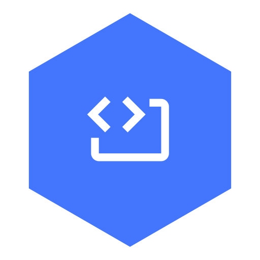
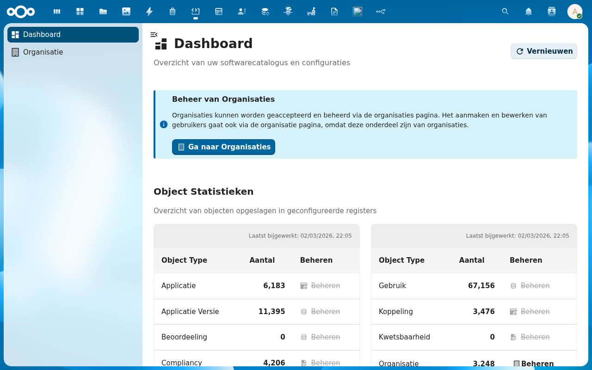
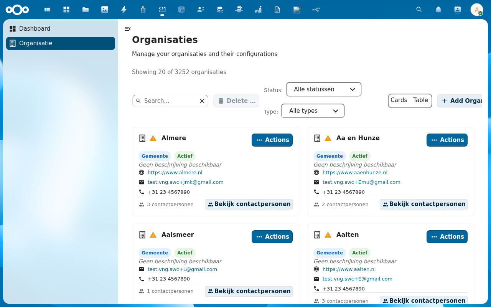
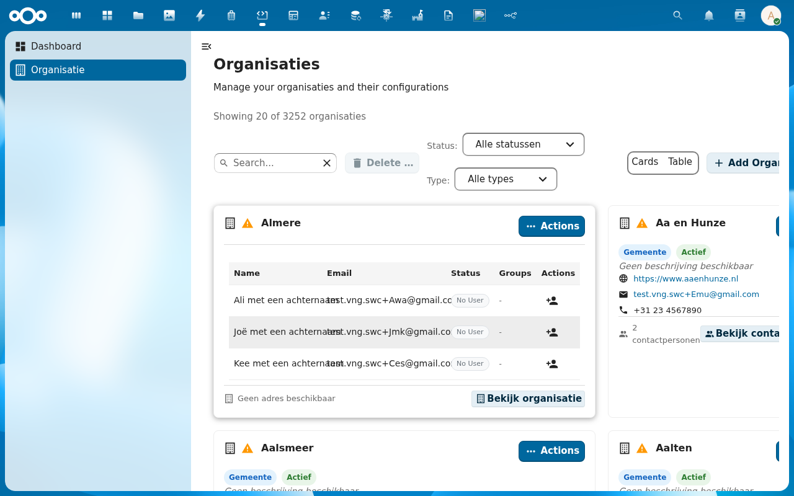
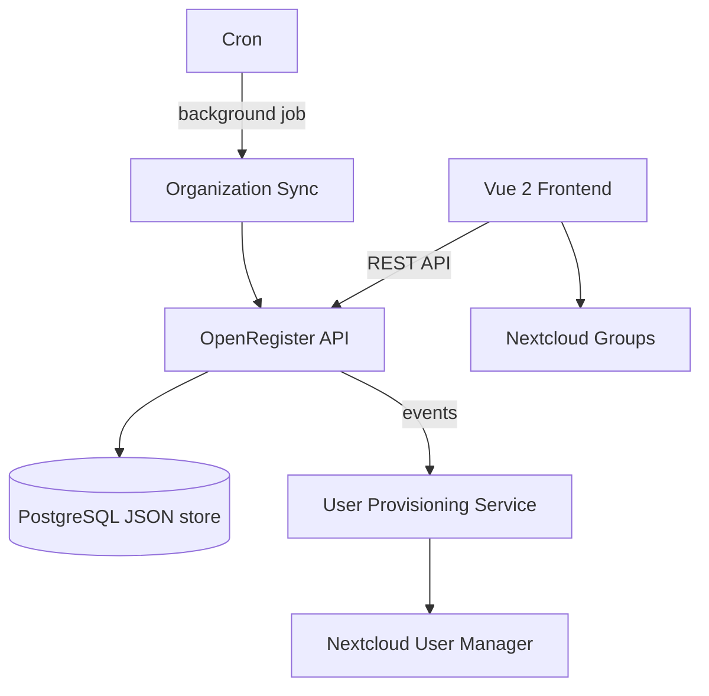

<p align="center">
  
</p>

<h1 align="center">Software Catalogus</h1>

<p align="center">
  <strong>GEMMA-compliant software catalog for Nextcloud — applications, modules, and integration management</strong>
</p>

<p align="center">
  <a href="https://codeberg.org/Conduction/softwarecatalog/releases"></a>
  <a href="https://codeberg.org/Conduction/softwarecatalog/src/branch/main/LICENSE"></a>
  <a href="https://ci.codeberg.org/repos/Conduction/softwarecatalog"></a>
  <a href="https://softwarecatalog.app"></a>
</p>

---

Software Catalogus brings structured software portfolio management to Nextcloud. Register the applications, modules, and connections (koppelingen) that make up your organization's IT landscape, manage contacts and organizations, and synchronize catalog data across a federated open data network — all aligned with Dutch GEMMA standards.

It integrates with [OpenRegister](https://codeberg.org/Conduction/openregister) for data storage and automatic user provisioning, turning register contacts into Nextcloud accounts with role-based group membership.

> **Requires:** [OpenRegister](https://codeberg.org/Conduction/openregister) — all data is stored as OpenRegister objects (no own database tables).

## Screenshots

<table>
  <tr>
    <td></td>
    <td></td>
    <td></td>
  </tr>
  <tr>
    <td align="center"><em>Dashboard</em></td>
    <td align="center"><em>Applications</em></td>
    <td align="center"><em>Connections</em></td>
  </tr>
</table>

## Features

### Application Management
- **Software Landscape** — Register and maintain all applications (voorzieningen) in your organization
- **Module Tracking** — Break applications into modules and track their versions, suppliers, and dependencies
- **Connection Mapping** — Define koppelingen (integrations) between applications and modules to visualize data flows
- **Contract Administration** — Link contracts to applications and track license agreements

### Organization Management
- **Organization Registry** — Manage organizations and their contact persons within the catalog
- **Automatic User Provisioning** — Create Nextcloud accounts from contactpersoon objects in OpenRegister
- **Role-Based Groups** — Automatic group assignment based on user roles (beheerder, inkoper, ambtenaar)
- **Organizational Hierarchy** — First user in an organization becomes beheerder; manager relationships maintained automatically

### Synchronization
- **Federated Sync** — Share and synchronize catalog data with other organizations over a federated network
- **Open Data Publishing** — Automatically publish your software catalog for transparency and reuse
- **Event-Driven Processing** — Real-time user and group updates via OpenRegister event listeners
- **Background Jobs** — Scheduled organization-contact synchronization via Nextcloud cron

### Integrations
- **OpenRegister** — All data stored as JSON objects in OpenRegister schemas
- **Nextcloud Groups** — Automatic group creation and membership management per organization and role
- **Manager Relationships** — Beheerders become Nextcloud managers for their organization's users

## Architecture



### Data Model

| Object | Description | GEMMA Mapping |
|--------|-------------|---------------|
| Voorziening | Application in the software landscape | Applicatie |
| Module | Component within an application | Module / Component |
| Koppeling | Integration between modules or applications | Koppeling |
| Organisatie | Organization that uses or supplies software | Organisatie |
| Contactpersoon | Individual linked to an organization | Contactpersoon |
| Contract | License or service agreement | Contract |

**Data standard:** GEMMA Softwarecatalogus with Schema.org compatibility.

### Directory Structure

```
softwarecatalog/
├── appinfo/           # Nextcloud app manifest, routes, navigation
├── lib/               # PHP backend — controllers, services, event listeners
│   ├── Controller/    # API and page controllers
│   ├── Service/       # Business logic (user provisioning, sync, groups)
│   └── Listener/      # OpenRegister event listeners
├── src/               # Vue 2 frontend — components, Pinia stores, views
│   ├── views/         # Route-level views (dashboard, voorzieningen, organisaties…)
│   └── store/         # Pinia stores per entity
├── docs/              # Technical documentation
├── img/               # App icons and screenshots
├── l10n/              # Translations (en, nl)
└── docusaurus/        # Product documentation site (softwarecatalog.app)
```

## Requirements

| Dependency | Version |
|-----------|---------|
| Nextcloud | 28 -- 33 |
| PHP | 8.0+ |
| [OpenRegister](https://codeberg.org/Conduction/openregister) | latest |

## Installation

### From the Nextcloud App Store

1. Go to **Apps** in your Nextcloud instance
2. Search for **Software Catalogus**
3. Click **Download and enable**

> OpenRegister must be installed first. [Install OpenRegister -->](https://apps.nextcloud.com/apps/openregister)

### From Source

```bash
cd /var/www/html/custom_apps
git clone https://codeberg.org/Conduction/softwarecatalog.git
cd softwarecatalog
npm install
npm run build
php occ app:enable softwarecatalog
```

## Development

### Start the environment

```bash
docker compose -f openregister/docker-compose.yml up -d
```

### Frontend development

```bash
cd softwarecatalog
npm install
npm run dev        # Watch mode
npm run build      # Production build
```

### Code quality

```bash
# PHP
composer phpcs          # Check coding standards
composer cs:fix         # Auto-fix issues
composer phpmd          # Mess detection
composer phpmetrics     # HTML metrics report

# Frontend
npm run lint            # ESLint
npm run stylelint       # CSS linting
```

## Tech Stack

| Layer | Technology |
|-------|-----------|
| Frontend | Vue 2.7, Pinia, @nextcloud/vue |
| Build | Webpack 5, @nextcloud/webpack-vue-config |
| Backend | PHP 8.0+, Nextcloud App Framework |
| Data | OpenRegister (PostgreSQL JSON objects) |
| UX | @conduction/nextcloud-vue |
| Quality | PHPCS, PHPMD, phpmetrics, ESLint, Stylelint |

## Documentation

Full documentation is available at **[softwarecatalog.app](https://softwarecatalog.app)**

| Page | Description |
|------|-------------|
| [Features](docs/FEATURES.md) | Complete feature specification |
| [Architecture](docs/ARCHITECTURE.md) | Technical architecture and design decisions |
| [User Guide](docs/USER_GUIDE.md) | End-user and administrator guide |
| [Configuration](docs/CONFIGURATION.md) | Setup instructions and troubleshooting |

## Testing

Software Catalogus is tested through three complementary layers that together provide comprehensive quality assurance.

### Code Quality (Conduction Quality Workflow)

Every commit runs through the [Conduction quality workflow](https://codeberg.org/Conduction/softwarecatalog/actions) — a strict CI/CD pipeline that enforces:

- **PHP Lint** — syntax validation
- **PHPCS** — coding standards (PEAR + PSR-12 + custom Conduction rules, including forbidden functions and named parameter enforcement)
- **PHPMD** — mess detection (clean code, code size, design, naming, and unused code rules)
- **Psalm** — static analysis (level 4, with unused code detection)
- **PHPStan** — static analysis (level 5)
- **PHPUnit** — unit and integration tests (strict mode: `failOnRisky`, output detection, execution order by dependency)
- **ESLint** — JavaScript/Vue linting
- **Stylelint** — CSS linting

All checks must pass before a release. Run locally with `composer check:strict` (full PHP pipeline) or `npm run lint` (frontend).

### API Tests (454 Assertions)

A dedicated Newman/Postman collection validates the entire API surface with **454 automated assertions** across 334 requests organized in 11 test folders:

| Folder | Coverage |
|--------|----------|
| Setup | Test data creation and environment validation |
| Public API & Search | Faceted search, pagination, UUID resolution |
| RBAC & Organization Scoping | Multi-tenant access control |
| Object CRUD | Create, read, update, delete across all entity types |
| Data Migration & Import | CSV/Magic Mapper imports |
| ArchiMate & Views | GEMMA architecture elements and relations |
| User Profile & Authentication | Login, password, session management |
| Export & Reporting | CSV and Excel export |
| Aanbod & Gebruik | Supply and usage registration |
| Data Quality & Naming | Naming conventions and data consistency |
| Glossary & Content | Glossary terms and CMS content |

Run with: `npx newman run tests/postman_collection.json -e tests/api/.env_00_-_Setup.json`

### Agentic Browser Tests (1,026 Acceptance Criteria)

AI-driven browser agents test the application from **7 real-world persona perspectives**, each with their own Nextcloud account, role-based permissions, and test scenarios. The agents use Playwright to interact with the live application exactly as a human would — navigating pages, filling forms, clicking buttons, and verifying results.

| Persona | Role | Focus |
|---------|------|-------|
| Leverancier | Software supplier | Wizard flows, application/dienst/koppeling management |
| Gemeente | Municipal user | Search, filters, wizard text, data quality |
| Security Officer | Security auditor | RBAC enforcement, data exposure, access control |
| Functioneel Beheerder | Functional administrator | Configuration, backend management, exports |
| Samenwerking | Collaboration partner | Cross-organization features, member delegation |
| Bezoeker | Anonymous visitor | Public access, unauthenticated search, privacy |
| Architectuur Expert | Enterprise architect | GEMMA API, ArchiMate views, OAS documentation |

Together these agents validate **1,026 acceptance criteria** across 137 GitHub issues, covering end-to-end user journeys, RBAC boundaries, wizard completions, and data integrity. Each persona receives a dedicated skill file (`.claude/skills/test-{persona}.md`) containing their assigned issues and test instructions. Results are stored in `test-results/` with per-persona reports.

Run with: `.claude/commands/test.md` (all tests) or individual persona skills.

### Issue Management & Acceptance Criteria

VNG did not begin filing issues for the Softwarecatalogus until October 2025, and when they did, the issues contained only descriptions — no structured acceptance criteria. Since our agentic test pipeline requires explicit, verifiable acceptance criteria to determine pass/fail outcomes, we set up a parallel system of **markdown shadow issues** in `test-results/api/issues/`. Each shadow issue mirrors a VNG GitHub issue but adds the structured acceptance criteria (AC1, AC2, …) that our API and browser agents need.

The master file `issues.md` tracks all 137 IGS (In Review/Scoped) issues with their **1,026 acceptance criteria**, each tagged by test type (`[API]`, `[UI]`, or `[HYBRID]`). Of these, **316 criteria** are covered by the automated Newman/Postman suite, while the remainder are validated by the persona-based browser agents. This approach maintains full traceability back to the original VNG issues while giving our test automation the concrete, testable assertions it requires.

## Standards & Compliance

- **Data standard:** GEMMA Softwarecatalogus (VNG)
- **Architecture:** Common Ground principles — layered, API-first, open source
- **Accessibility:** WCAG AA (Dutch government requirement)
- **Authorization:** RBAC via OpenRegister
- **Audit trail:** Full change history on all objects
- **Localization:** English and Dutch

## Required Repositories

The Softwarecatalogus is not a standalone application — it runs as a Nextcloud app backed by several other apps, with a separate React-based public frontend.

| Repository | Role | Required |
|-----------|------|----------|
| [OpenRegister](https://codeberg.org/Conduction/openregister) | Data storage layer — all objects (applications, modules, organizations, contacts) are stored as JSON objects in OpenRegister. Also provides the Docker environment (`docker-compose.yml`). | Yes |
| [OpenCatalogi](https://codeberg.org/Conduction/opencatalogi) | Publication and catalog management — handles public search, faceted filtering, and federated publishing of catalog data. | Yes |
| [NL Design](https://codeberg.org/Conduction/nldesign) | Design token theming — applies Dutch government (NL Design System) styling via CSS custom properties. | Yes |
| [Tilburg WOO UI](https://codeberg.org/Conduction/tilburg-woo-ui) | **Separate public frontend** — a React/Preact SPA that serves as the citizen-facing interface at `localhost:3000`. Provides public search, detail pages, and registration forms (product, usage, integration, organization). This is **not** a Nextcloud app but a standalone web application that communicates with Nextcloud via the OpenRegister and OpenCatalogi APIs. | Yes |
| [LaunchPad](https://codeberg.org/Conduction/launchpad) | Dashboard widgets for the Nextcloud dashboard page. | Recommended |

## Installation

### 1. Start the Docker environment

The Docker environment is managed from the OpenRegister repository:

```bash
cd openregister
docker compose up -d            # Core: PostgreSQL + Nextcloud + n8n
docker compose --profile ui up -d  # Adds the Tilburg WOO UI frontend
```

This starts:
- **Nextcloud** at `http://localhost:8080` (admin:admin)
- **Tilburg WOO UI** at `http://localhost:3000` (public frontend)
- **PostgreSQL 16** with pgvector and pg_trgm extensions
- **n8n** for workflow automation

### 2. Install Nextcloud apps (order matters)

Apps must be enabled in this order because of dependency chains:

```bash
# 1. OpenRegister — foundation, must be first
docker exec -u www-data nextcloud php occ app:enable openregister

# 2. OpenCatalogi — depends on OpenRegister for publication data
docker exec -u www-data nextcloud php occ app:enable opencatalogi

# 3. NL Design — theming (no hard dependencies, but should be early)
docker exec -u www-data nextcloud php occ app:enable nldesign

# 4. Software Catalogus — depends on OpenRegister and OpenCatalogi
docker exec -u www-data nextcloud php occ app:enable softwarecatalog

# 5. LaunchPad — optional, for dashboard widgets
docker exec -u www-data nextcloud php occ app:enable launchpad
```

### 3. Import data

The Softwarecatalogus requires register schemas and seed data to function. Import the configurations via the OpenRegister Magic Mapper:

```bash
# Import the softwarecatalogus register configuration
# This creates the voorzieningen register with all required schemas
# (module, dienst, organisatie, contactpersoon, contract, etc.)
curl -X POST "http://localhost:8080/index.php/apps/openregister/api/configurations?force=true" \
  -u admin:admin \
  -H "Content-Type: application/json" \
  -d @softwarecatalog/configurations/softwarecatalogus_register.json
```

For a complete test environment with users, organizations, and sample data:

```bash
bash softwarecatalog/test-setup.sh
```

This creates 7 test users across 4 organizations (leverancier, gemeente, samenwerking, admin), seeds contact persons and sample applications, and verifies RBAC scoping.

### 4. Build frontends

```bash
# Nextcloud app frontend (Vue 2)
cd softwarecatalog && npm install && npm run build

# Public frontend (React) — only needed if not using Docker
cd tilburg-woo-ui && yarn install && yarn build
```

## Support

For support, contact us at [support@conduction.nl](mailto:support@conduction.nl).

For a Service Level Agreement (SLA), contact [sales@conduction.nl](mailto:sales@conduction.nl).

## License

EUPL-1.2

## Authors

Built by [Conduction](https://conduction.nl) — open-source software for Dutch government and public sector organizations.
